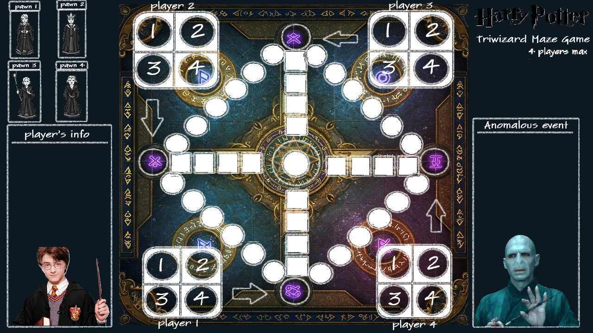
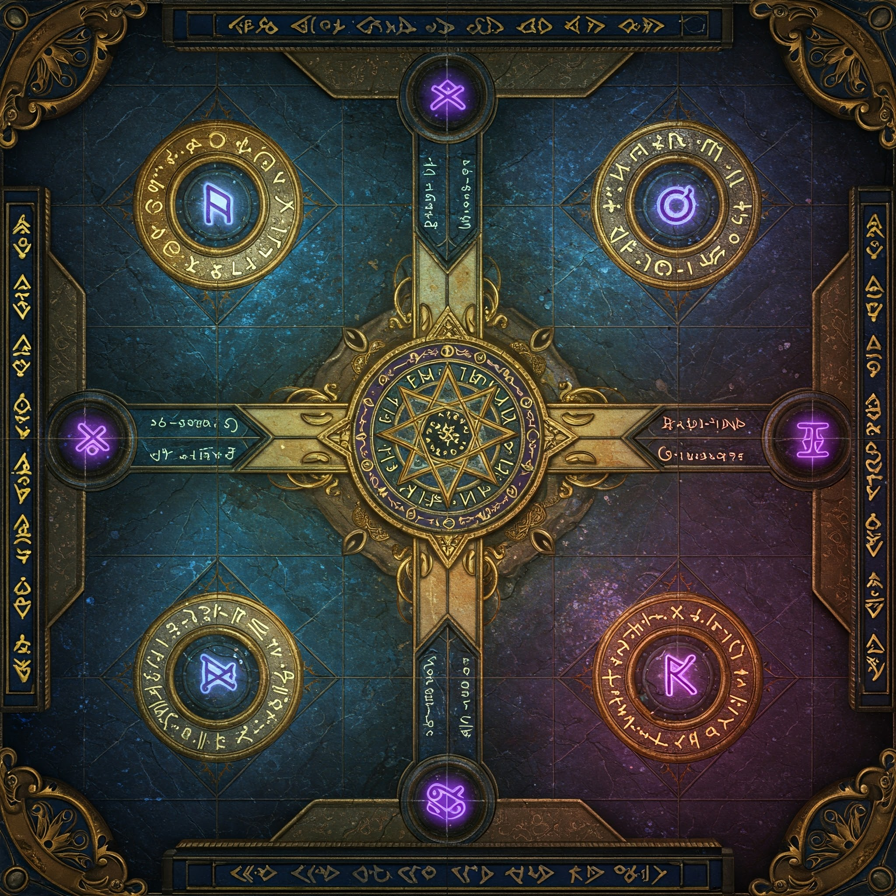
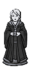
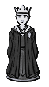
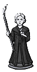
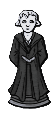

# Triwizard-Maze-Game-Coursework
**[Class-1, Team-6]**  
This project was developed for the *LUC/BJTU course CNSCC.111* (taught by Dr. Hasan Ahmed) during the spring semester. Our team’s project was to develop a 2D strategy board game called Triwizard Maze Game, from the Harry Potter universe. [RealItemLink](https://www.amazon.co.uk/Goliath-Games-4331-06-Potter-Tri-Wizard/dp/B01LYHF6ER/ref=asc_df_B01LYHF6ER/?tag=googshopuk-21&linkCode=df0&hvadid=310869104636&hvpos=&hvnetw=g&hvrand=8971483422015750214&hvpone=&hvptwo=&hvqmt=&hvdev=c&hvdvcmdl=&hvlocint=&hvlocphy=9046582&hvtargid=pla-379840404184&th=1)  
If you have any questions, contect with *billkingiscool@gmail.com*
## About this game
So far, there are no official rules for the Triwizard Maze Game. In this project, we based our game rules on one of commercially successful board bands with high sales volume.  


Our main chessboard:  



## Dependencies
Pycharm 2025  
Python 3.9  
Pygame 2.6.1
### Installation
```cmd
pip install pygame==2.6.1
```
## Running the Program
### Windows Command Prompt:
```cmd
cd C:\Users\Triwizard_Maze_Game_Coursework-main
python startMainGame.py
```
## Directory Content
### [chessSetting](chessSetting)
***
#### [position_store.py](position_store.py)
Store the position coordinates of each square and the information about interactions with the pieces in a dictionary.
#### [chess.py](chess.py)
The class of chess consists of some status flags and movement method.  
Some high-level movement functions are defined outside the class to better accommodate Pygame's function calls.
### [chess_interaction](chess_interaction)
***
#### [move_in_board.py](move_in_board.py)
Define a function that handles how a chess piece moves on the board and how it responds to encountering enemies and magic traps.
#### [trapSetting.py](trapSetting.py)
Define a function that generates a new list of trap positions each time the game starts, ensuring they are different from previous positions.
### [screen_effect](screen_effect)
***
#### [element_effect.py](element_effect.py)
Include functions about: die rotation, inputting prompt, showing text, counting down animation, and loading music.
### [all_image](all_image)
***
We use Gemini 2.0 to generate the textures and then modify them based on our needs.  
They are original pictures:  
  
   
### [audioNvidio](audioNvidio)
***
BGM:  
Enya. (1995). *Anywhere Is*. On *Anywhere Is* [CD]. Warner Music.
### [startMainGame.py](startMainGame.py)
***
This is the main entry point of the program, where functions from all files are called.
